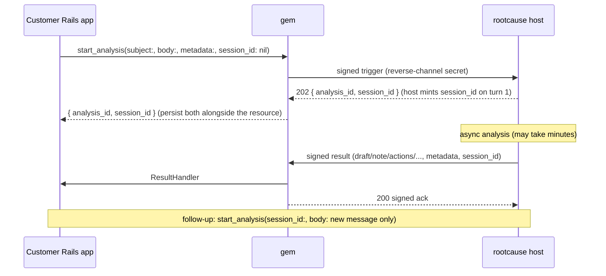

# Async analysis — customer-initiated trigger + result callback (gem side)

**Status:** proposal (v1). Extends [SPEC.md](../SPEC.md). This is the **gem's slice** of a new
capability: the customer's app **triggers an analysis** on the rootcause host and later **receives the
result** asynchronously into a Ruby handler. The host side (ingest endpoint, run lifecycle, result
delivery) lives in
[`rootcause-light/docs/async-analysis-host-spec.md`](https://github.com/rootcause-org/rootcause-light/blob/main/docs/async-analysis-host-spec.md)
— read it for everything off-gem.

**Session continuation (host-managed).** rootcause keeps the conversation history server-side, keyed by
an opaque **`session_id`**. The first `start_analysis` omits it; the host mints one and returns it in the
202. A follow-up passes that `session_id` back and sends **only the new message** — never prior turns,
which the host already holds. The gem treats `session_id` as **opaque**: it stores and forwards the
string, never interprets it (provider-managed state is unavailable via OpenRouter and non-portable across
vendors, so the *host* owns the history and the gem only carries the key). Correlation is by `metadata`
and the per-analysis `analysis_id`; continuation is by `session_id`.

## 1. Why this exists

Today the gem is a pure **receiver**: rootcause POSTs a signed **invocation**, the gem resolves the
script by digest, runs it, returns a signed result (SPEC §3). That stays exactly as-is.

This adds the **opposite direction** for a different job: the customer's own code (e.g. a support-ticket
controller) wants to ask rootcause *"analyze this"* and get the drafted answer back **later**, keyed to
one of its own resources — without polling and without standing up a job/callback rig of its own.

Two new motions, both on the existing **reverse-channel secret** (the same secret the gem already holds
for invocations — no new secret):

- **Analysis trigger** — gem → rootcause, a signed POST that opens an analysis. Returns immediately.
- **Analysis result** — rootcause → gem, a signed POST delivered when the analysis finishes; dispatched
  to a customer-written `ResultHandler`.



### What this is *not* (boundary with SPEC §1)

The gem stays a **receiver of side-effects it does not decide**. The *result* is **data**, dispatched to
the customer's own handler — it is **not** an autonomous action and never runs a registry script. Vetted,
digest-pinned **actions** remain **human-gated**: if the analysis proposes any, they ride back in the
result's `actions[]` as buttons/links the customer renders for a human to click (§4), exactly as ReplyPen
does. We do **not** add autonomous actions.

## 2. Public API (what the customer writes)

Config additions (extends SPEC §4):

```ruby
RootCause::ActionRunner.configure do |c|
  c.secret          = ENV.fetch("ROOTCAUSE_ACTION_SECRET") # SAME reverse-channel secret as invocations
  c.mount_at        = "/rootcause/action"                  # invocation route (unchanged)
  # --- new ---
  c.trigger_url     = "https://<rootcause>/analyses/<project>" # where start_analysis POSTs
  c.result_mount_at = "/rootcause/result"                  # route that receives async results
  c.result_handler  = "AnalysisResultHandler"              # String → lazy-loaded, reload-safe
  c.max_attachment_bytes = 256 * 1024                      # per-attachment inline cap (decoded)
end
```

**Trigger** — call from anywhere in app code:

```ruby
analysis = RootCause::ActionRunner.start_analysis(
  subject: ticket.subject,
  body:    ticket.body,                       # plain text only (v1)
  attachments: [
    { filename: "error.log", mime_type: "text/plain",
      content_base64: Base64.strict_encode64(ticket.log_file) },
  ],
  metadata: { resource_type: "SupportTicket", resource_id: ticket.id }, # echoed back verbatim
  session_id: nil,                            # optional — omit/nil on the first turn (§2.1)
)
analysis.analysis_id  # => "uuid"  (rootcause run id, for audit/idempotency/correlation)
analysis.session_id   # => "uuid"  (host-minted; persist it to continue this conversation)
```

**Result handler** — a plain class in `app/`, the ActionMailbox/ActiveJob shape:

```ruby
# app/rootcause/analysis_result_handler.rb
class AnalysisResultHandler < RootCause::ActionRunner::ResultHandler
  # Runs inline in the result request, under the configured timeout. Keep it a quick write.
  # MUST be idempotent: rootcause redelivers on a lost ack (see §6).
  def process(result)
    return unless result.metadata[:resource_type] == "SupportTicket"
    ticket = SupportTicket.find_by(id: result.metadata[:resource_id])
    return unless ticket # resource gone during the async window → drop cleanly

    if result.decline
      ticket.update!(analysis_state: :declined, analysis_note: result.decline[:reason])
    else
      ticket.update!(
        analysis_state:  :ready,
        ai_draft:        result.draft&.dig(:body_markdown),
        ai_note:         result.note&.dig(:body_markdown),
        rc_session_id:   result.session_id, # persist to continue the thread later (§2.1)
      )
      # Optional human-gated side-effects → render as buttons; never auto-execute (§4).
      ticket.update!(rc_actions: result.actions)
    end
  end
end
```

### The `Result` object (mirrors rootcause's `CallbackPayload`)

```ruby
result.analysis_id     # String   — the run id this answers
result.session_id      # String   — host-managed conversation key; persist + forward (opaque)
result.metadata        # Hash      — your bag, echoed back verbatim (symbol keys)
result.draft           # { body_markdown:, body_html: } or nil
result.note            # { body_markdown:, body_html:, body_text: } or nil
result.actions         # [ { id:, label:, description:, url:, color: } ]  (human-gated; see §4)
result.reasoning_steps # [String]
result.attachments     # [ { filename:, mime_type:, content_base64: } ]
result.decline         # { reason: } or nil
result.ok?             # decline.nil?
```

Field names are taken **verbatim** from rootcause's `webhook.CallbackPayload` and ReplyPen's contract so
all three products serialize identically.

### 2.1 Continuing a conversation

A follow-up is the **same call** with the persisted `session_id` and **only the new message** — the host
already holds the prior turns, so the gem never re-sends them:

```ruby
RootCause::ActionRunner.start_analysis(
  subject:    "Still failing after the reset",
  body:       customer_reply,                  # just the new message, no prior history
  session_id: ticket.rc_session_id,            # the id you persisted from turn 1 / the result
  metadata:   { resource_type: "SupportTicket", resource_id: ticket.id },
)
```

Rules:
- **First turn** — omit `session_id` (or pass `nil`); the gem leaves it out of the body and the host mints
  one, returned in the 202 and echoed on every subsequent result.
- **Opaque** — the gem stores and forwards the string; it never parses, validates, or reuses it across
  resources. Whatever the host returns is what you send back.
- **`metadata` still rides every turn** — it is your correlation bag and is echoed back per result;
  `session_id` is the host's history key, orthogonal to it.

## 3. Wire messages (on the reverse-channel secret)

Both messages use the existing scheme: `X-Webhook-Signature: sha256=<hex>` (HMAC-SHA256 over the **raw**
body), constant-time compare, sign-then-send / verify-on-raw — identical to SPEC §5.

**Analysis trigger** (gem → rootcause), `POST {trigger_url}` — signed:

```jsonc
{
  "subject":     "Login fails after password reset",
  "body":        "plain-text content to analyze",
  "attachments": [ { "filename": "error.log", "mime_type": "text/plain", "content_base64": "…" } ],
  "metadata":    { "resource_type": "SupportTicket", "resource_id": 42 }, // opaque, echoed back
  "session_id":  "uuid",          // OPTIONAL — present only on a follow-up; omitted on turn 1
  "nonce":       "uuid",
  "issued_at":   "2026-06-04T10:00:00Z" // ±5 min window
}
```

Response `202`: `{ "analysis_id": "uuid", "session_id": "uuid", "status": "queued" }`. The host **mints**
`session_id` on the first turn and **echoes** the same one on follow-ups; the gem surfaces it as
`analysis.session_id`.

**Analysis result** (rootcause → gem), `POST {result_mount_at}` — signed; body is the `Result` JSON
above plus `analysis_id`, `session_id`, `nonce`, `issued_at`. The gem verifies signature + replay, then
dispatches to `result_handler` (which sees `result.session_id`). Returns a signed `200 { "ok": true }`
ack.

## 4. Human-in-the-loop is preserved via `actions[]`

The split that keeps the SPEC §1 invariant intact:

- **`draft` / `note` / `reasoning_steps` / `attachments`** — informational analysis output → safe to
  **auto-burn** into the customer's records. No gate.
- **`actions[]`** — vetted side-effects rootcause *proposes*. Each is a `{ label, description, url }`
  pointing at rootcause's single-use, expiring confirm page. The customer **renders** them (a human
  clicks) → rootcause executes via the gem's **existing invocation route**. The gem never auto-runs them.

So one result can both fill a draft *and* surface approve-buttons, cleanly separated by field. No
"autonomous action" feature is needed.

## 5. Idempotency & fail-closed

- **Result redelivery is when-not-if.** If the gem's ack is lost, rootcause retries. The replay-guard
  (±5 min window + nonce) rejects same-window duplicates; a retry *outside* the window is a fresh nonce
  and **will** dispatch again. Therefore **`ResultHandler#process` must be idempotent** — upsert by
  `metadata` (or `analysis_id`), never blind-insert. Documented loudly, enforced by example.
- **Fail closed** (mirrors SPEC §3): bad signature, stale/duplicate nonce, missing required fields,
  unconfigured `result_handler` → refuse, signed structured error, log it.
- **Trigger failures** (`start_analysis`): non-2xx / timeout → raise a `RootCause::ActionRunner::TriggerError`;
  the caller decides whether to retry (the call is the customer's, so no silent swallow).

## 6. Attachments (v1 constraints)

- **Body is plain text only.** No markdown/HTML split on the trigger (the result keeps rootcause's
  `body_markdown`/`body_html` fields for output).
- **Inline base64 only, capped** at `max_attachment_bytes` per attachment (default 256 KiB decoded).
  Over-cap → `start_analysis` raises before sending. Large files / fetch-URLs are **out of scope** (SPEC
  §11) — same posture as ReplyPen.

## 7. Security (deltas from SPEC §7)

- **Same secret, same primitives.** Reverse-channel HMAC, constant-time, verify-on-raw, replay window —
  no new crypto, no new secret.
- **`metadata` transits rootcause and returns** → scalars only, kept small, **no secrets/PII**. We log
  metadata **keys** only (like param keys), never values.
- **Result handler runs as the app** with full privileges, like the executor. Keep it a fast, idempotent
  write; offloading to a job reintroduces the infra this feature exists to avoid.
- The result route should be restricted to rootcause's egress IP at the edge, same recommendation as the
  invocation route (SPEC §4).

## 8. Layout (new files)

```
lib/rootcause/action_runner/
├── client.rb          # start_analysis: build → sign → POST → parse {analysis_id, session_id}
├── result.rb          # Result value object (symbol-keyed, frozen)
├── result_handler.rb  # base class; #process(result)
└── result_rack.rb     # result route: verify → replay → dispatch → signed ack
```

`signature.rb`, `replay.rb`, the Net::HTTP pattern in `resolver.rb`, and `config.rb` are **reused**, not
duplicated.

## 9. Testing (mirrors SPEC §10)

| Area | What |
|---|---|
| **Trigger** | builds the documented body; signs correctly; parses `analysis_id`; non-2xx → `TriggerError`; over-cap attachment → raises pre-send. |
| **Result route** | sign round-trip; forged/missing signature rejected; stale/duplicate nonce rejected; dispatches to handler; returns signed ack. |
| **Idempotency** | a redelivered result (fresh nonce) dispatches again → example handler upserts, not duplicates. |
| **Result object** | maps `CallbackPayload` JSON → symbol-keyed accessors; `decline` → `ok? == false`; absent optional fields → nil. |
| **Session continuation** | `session_id` present → forwarded in the trigger body; absent/blank → omitted; result exposes `session_id`; full round-trip (trigger → `result.session_id` → follow-up trigger carries it). |
| **Handler config** | string-named handler lazy-loads; missing handler → fail closed, structured error. |

Stub the rootcause origin (trigger 202 + result POST) so the suite needs no live host.

## 10. Open questions

1. **Trigger auth shape** — sign the raw JSON body (chosen here, consistent with invocations) vs. a
   bearer token like the Prompt API. Reverse-channel HMAC keeps it to one secret; confirm with host.
2. **Result route vs. reuse `mount_at`** — separate route (chosen, easier to firewall) vs. one route
   discriminating on a `type` field.
3. **Per-attachment cap value** — 256 KiB default; reconcile with the host's inbound limit.
